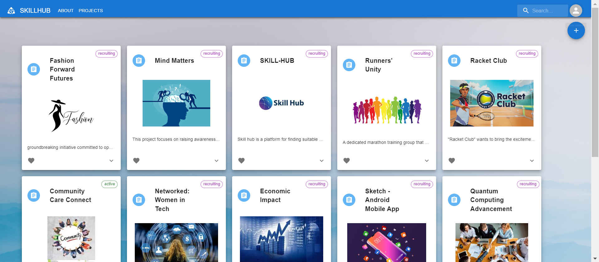

# SkillHub

Welcome to our new generation social innovation hub!
'SKILLHUB' is a web application that is aimed at helping people finding partners and teamates for their projects.

## Built With

* [React](https://react.dev/) - React is a popular JavaScript library for building web and native user interfaces.
* [Node.js](https://nodejs.org/en) - Node.js is an open-source JavaScript runtime environment.
* [Firebase](https://firebase.google.com//) - Firebase is an app development platform that helps you build and grow apps and games users love. Backed by Google and trusted by millions of businesses around the world.

## Team members

* [Idan Zimilis](https://github.com/IdanZimi)
  - ID : 316133222
* [Ido Yekutiel](https://github.com/Idoyek)
  - ID : 207071713
* [Shiran Swissa](https://github.com/Swisash)
  - ID : 206549164

## Contact Information

For any inquiries or questions, please feel free to contact us at:

* Phone: 054-345-6925

## See It in Action: A Quick Video Demo

https://drive.google.com/file/d/1O_Sgug3pbDemWowD5iezh4CanvKrHanE/view?usp=drivesdk  

## Installation

Follow these steps to install and run the project:

1. **Clone the Repository:**  
  - git clone https://github.com/IdanZimi/SkillHub  
  - cd SkillHub  

2. **Server Setup:**  

Navigate to the server directory:  

  - cd skillHub_Server  
  - npm install  
  - npm start  
  - The server should now be running on `http://localhost:8000`  

3. **Client Setup:**  

Navigate to the client directory:  

  - cd skill-hub  
  - npm install  
  - npm start  
  - The client application should now be running on `http://localhost:3000`  

## License

This project is licensed under the MIT License - see the [LICENSE](LICENSE) file for details